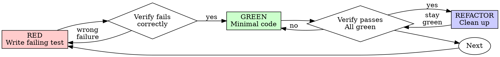

# Test-Driven Development (TDD)

## Overview

Write the test first. Watch it fail. Write minimal code to pass.

**Core principle:** If you didn't watch the test fail, you don't know if it tests the right thing.

**Violating the letter of the rules is violating the spirit of the rules.**

## When to Use

**Always:**
- New features
- Bug fixes
- Refactoring
- Behavior changes

**Exceptions (ask your human partner):**
- Throwaway prototypes
- Generated code
- Configuration files

Thinking "skip TDD just this once"? Stop. That's rationalization.

## Fast-Lane and Middle-Lane Exceptions (superpowers-lite)

In the **fast lane** and **middle lane** (set by `using-superpowers`), TDD remains mandatory for anything that contains behavior. These lanes are about removing planning ceremony, not removing tests.

Fast-lane and middle-lane work may skip a test-first pass — without asking the human partner — for these specific categories where a test would have no real signal:

- **Pure configuration changes** — flipping a flag, changing a value in YAML/TOML/JSON, updating an env-var default. (If a test would just assert "the file contains X", skip it.)
- **Copy / string changes** — user-facing text, error messages, labels, button copy. (Manual UI check or visual review is sufficient.)
- **Style-only changes** — CSS, Tailwind, layout/spacing with no behavior. (Visual check is sufficient.)
- **Trivial renames inside one module** — local variable or private function rename with no external callers; the type-checker is proof of correctness.
- **Purely declarative database migrations** — adding a column with a default, adding an index. (Run the migration locally + the existing test suite is the review.)

For ANY change that contains conditional logic, transforms data, validates input, or produces output a user sees as a result of computation — **TDD is mandatory regardless of lane**. A fast-lane or middle-lane bug fix in a date parser still gets a failing test first.

These are the only exceptions. "It's a one-liner" is not on the list. "I'll add the test after" is not on the list. If you're unsure whether a change qualifies, write the test.

## The Iron Law

```
NO PRODUCTION CODE WITHOUT A FAILING TEST FIRST
```

Write code before the test? Delete it. Start over.

**No exceptions:**
- Don't keep it as "reference"
- Don't "adapt" it while writing tests
- Don't look at it
- Delete means delete

Implement fresh from tests. Period.

## Red-Green-Refactor



### RED - Write Failing Test

Write one minimal test showing what should happen.

<Good>
```typescript
test('retries failed operations 3 times', async () => {
  let attempts = 0;
  const operation = () => {
    attempts++;
    if (attempts < 3) throw new Error('fail');
    return 'success';
  };

  const result = await retryOperation(operation);

  expect(result).toBe('success');
  expect(attempts).toBe(3);
});
```
Clear name, tests real behavior, one thing
</Good>

<Bad>
```typescript
test('retry works', async () => {
  const mock = jest.fn()
    .mockRejectedValueOnce(new Error())
    .mockRejectedValueOnce(new Error())
    .mockResolvedValueOnce('success');
  await retryOperation(mock);
  expect(mock).toHaveBeenCalledTimes(3);
});
```
Vague name, tests mock not code
</Bad>

**Requirements:**
- One behavior
- Clear name, nested per **Shape Tests as Behavior** below
- Real code (no mocks unless unavoidable)

### Verify RED - Watch It Fail

**MANDATORY. Never skip.**

```bash
npm test path/to/test.test.ts
```

Confirm:
- Test fails (not errors)
- Failure message is expected
- Fails because feature missing (not typos)

**Test passes?** You're testing existing behavior. Fix test.

**Test errors?** Fix error, re-run until it fails correctly.

### GREEN - Minimal Code

Write simplest code to pass the test.

<Good>
```typescript
async function retryOperation<T>(fn: () => Promise<T>): Promise<T> {
  for (let i = 0; i < 3; i++) {
    try {
      return await fn();
    } catch (e) {
      if (i === 2) throw e;
    }
  }
  throw new Error('unreachable');
}
```
Just enough to pass
</Good>

<Bad>
```typescript
async function retryOperation<T>(
  fn: () => Promise<T>,
  options?: {
    maxRetries?: number;
    backoff?: 'linear' | 'exponential';
    onRetry?: (attempt: number) => void;
  }
): Promise<T> {
  // YAGNI
}
```
Over-engineered
</Bad>

Don't add features, refactor other code, or "improve" beyond the test.

### Verify GREEN - Watch It Pass

**MANDATORY.**

```bash
npm test path/to/test.test.ts
```

Confirm:
- Test passes
- Other tests still pass
- Output pristine (no errors, warnings)

**Test fails?** Fix code, not test.

**Other tests fail?** Fix now.

### REFACTOR - Clean Up

After green only:
- Remove duplication
- Improve names
- Extract helpers

Keep tests green. Don't add behavior.

### Repeat

Next failing test for next feature.

## Good Tests

| Quality | Good | Bad |
|---------|------|-----|
| **Minimal** | One thing. "and" in name? Split it. | `test('validates email and domain and whitespace')` |
| **Clear** | Name describes behavior | `test('test1')` |
| **Shows intent** | Demonstrates desired API | Obscures what code should do |

## Shape Tests as Behavior (BDD)

Applies to every test you write, not just a hardening pass. Organize so the full
`describe → describe → it` path reads as a plain-English rule:

- Nest `describe` for state/preconditions (`when …`, `with …`, `without …`, `after …`).
- Each `it` proves **one** outcome; keep its text short.
- If an `it` needs `and` / `then` / `after` to describe itself, split it — another `describe` level, or a separate `it`. (`writes the membership`, then `after writing the membership → publishes a user invalidation` — never `writes … then publishes …`.)
- Split examples that can fail for unrelated reasons.
- Prefer integrated tests where behavior depends on real wiring; keep isolated tests only where they genuinely pin local behavior.

<Good>
```typescript
describe('PermissionMutationService', () => {
  describe('adding a profile to a group', () => {
    it('writes the membership', ...);

    describe('after writing the membership', () => {
      it('publishes a user invalidation', ...);
    });
  });
});
```
Each level adds a real precondition; each leaf is one outcome
</Good>

<Bad>
```typescript
describe('PermissionMutationService', () => {
  it('writes the membership and publishes a user invalidation', ...);
});
```
Two outcomes in one example — it can fail for unrelated reasons
</Bad>

**Nest on real preconditions only.** A level that restates the level above it, or that
wraps a single precondition in three, is ceremony — it makes the report longer without
making it clearer. If you can't say what state a `describe` introduces, drop it.

### Playwright

A Playwright test has no nested `it`, so the tree is built differently:

- Preconditions → nested `test.describe` (`unauthenticated`, `as an admin`).
- Distinct phases **inside one test** → `test.step`, and only where the test genuinely
  has more than one phase or asserts more than one outcome. Use it when a single real
  action (a login attempt, a rate-limited request) can't be repeated per example without
  fighting the app.
- One outcome per step, same as one outcome per `it`.

<Good>
```typescript
test.describe('unauthenticated', () => {
  test('an invalid password is rejected', async ({ page }) => {
    await attemptLogin(page, 'definitely-wrong-password');

    await test.step('stays on the login page', async () => { ... });
    await test.step('shows the incorrect-credentials message', async () => { ... });
  });
});
```
One real login attempt, each outcome its own named step
</Good>

## Why Order Matters

**"I'll write tests after to verify it works"**

Tests written after code pass immediately. Passing immediately proves nothing:
- Might test wrong thing
- Might test implementation, not behavior
- Might miss edge cases you forgot
- You never saw it catch the bug

Test-first forces you to see the test fail, proving it actually tests something.

**"I already manually tested all the edge cases"**

Manual testing is ad-hoc. You think you tested everything but:
- No record of what you tested
- Can't re-run when code changes
- Easy to forget cases under pressure
- "It worked when I tried it" ≠ comprehensive

Automated tests are systematic. They run the same way every time.

**"Deleting X hours of work is wasteful"**

Sunk cost fallacy. The time is already gone. Your choice now:
- Delete and rewrite with TDD (X more hours, high confidence)
- Keep it and add tests after (30 min, low confidence, likely bugs)

The "waste" is keeping code you can't trust. Working code without real tests is technical debt.

**"TDD is dogmatic, being pragmatic means adapting"**

TDD IS pragmatic:
- Finds bugs before commit (faster than debugging after)
- Prevents regressions (tests catch breaks immediately)
- Documents behavior (tests show how to use code)
- Enables refactoring (change freely, tests catch breaks)

"Pragmatic" shortcuts = debugging in production = slower.

**"Tests after achieve the same goals - it's spirit not ritual"**

No. Tests-after answer "What does this do?" Tests-first answer "What should this do?"

Tests-after are biased by your implementation. You test what you built, not what's required. You verify remembered edge cases, not discovered ones.

Tests-first force edge case discovery before implementing. Tests-after verify you remembered everything (you didn't).

30 minutes of tests after ≠ TDD. You get coverage, lose proof tests work.

## Common Rationalizations

| Excuse | Reality |
|--------|---------|
| "Too simple to test" | Simple code breaks. Test takes 30 seconds. |
| "I'll test after" | Tests passing immediately prove nothing. |
| "Tests after achieve same goals" | Tests-after = "what does this do?" Tests-first = "what should this do?" |
| "Already manually tested" | Ad-hoc ≠ systematic. No record, can't re-run. |
| "Deleting X hours is wasteful" | Sunk cost fallacy. Keeping unverified code is technical debt. |
| "Keep as reference, write tests first" | You'll adapt it. That's testing after. Delete means delete. |
| "Need to explore first" | Fine. Throw away exploration, start with TDD. |
| "Test hard = design unclear" | Listen to test. Hard to test = hard to use. |
| "TDD will slow me down" | TDD faster than debugging. Pragmatic = test-first. |
| "Manual test faster" | Manual doesn't prove edge cases. You'll re-test every change. |
| "Existing code has no tests" | You're improving it. Add tests for existing code. |

## Red Flags - STOP and Start Over

- Code before test
- Test after implementation
- Test passes immediately
- Can't explain why test failed
- Tests added "later"
- Rationalizing "just this once"
- "I already manually tested it"
- "Tests after achieve the same purpose"
- "It's about spirit not ritual"
- "Keep as reference" or "adapt existing code"
- "Already spent X hours, deleting is wasteful"
- "TDD is dogmatic, I'm being pragmatic"
- "This is different because..."

**All of these mean: Delete code. Start over with TDD.**

## Example: Bug Fix

**Bug:** Empty email accepted

**RED**
```typescript
test('rejects empty email', async () => {
  const result = await submitForm({ email: '' });
  expect(result.error).toBe('Email required');
});
```

**Verify RED**
```bash
$ npm test
FAIL: expected 'Email required', got undefined
```

**GREEN**
```typescript
function submitForm(data: FormData) {
  if (!data.email?.trim()) {
    return { error: 'Email required' };
  }
  // ...
}
```

**Verify GREEN**
```bash
$ npm test
PASS
```

**REFACTOR**
Extract validation for multiple fields if needed.

## Verification Checklist

Before marking work complete:

- [ ] Every new function/method has a test
- [ ] Watched each test fail before implementing
- [ ] Each test failed for expected reason (feature missing, not typo)
- [ ] Wrote minimal code to pass each test
- [ ] All tests pass
- [ ] Output pristine (no errors, warnings)
- [ ] Tests use real code (mocks only if unavoidable)
- [ ] Edge cases and errors covered
- [ ] Each `describe → it` path reads as a plain-English rule; no `and` in an `it` text

Can't check all boxes? You skipped TDD. Start over.

## When Stuck

| Problem | Solution |
|---------|----------|
| Don't know how to test | Write wished-for API. Write assertion first. Ask your human partner. |
| Test too complicated | Design too complicated. Simplify interface. |
| Must mock everything | Code too coupled. Use dependency injection. |
| Test setup huge | Extract helpers. Still complex? Simplify design. |

## Debugging Integration

Bug found? Write failing test reproducing it. Follow TDD cycle. Test proves fix and prevents regression.

Never fix bugs without a test.

## Hardening a Diff's Tests (coverage evidence for a PR)

The cycle above is per-feature and test-first. This is the complementary pass: given a diff, make the test suite read like a behavior spec and produce coverage evidence a reviewer can scan. Use it when hardening tests for a PR.

Inputs first: the **ticket + acceptance criteria**, the **branch diff**, and the repo's **test conventions** (framework, helpers, verification commands). If the ticket isn't in hand, stop and ask — don't infer it from the branch name or commits. If the diff base is ambiguous, ask which branch to compare against.

### 1. Scenario inventory (from the actual diff)

List every added/changed production symbol — route, service method, DTO/schema, query, guard, mapper, side effect, event, job, external call. For each, enumerate the scenarios that matter:
- happy path
- validation boundaries
- authorization / tenancy boundaries
- missing / empty / null / stale / duplicate / revoked / concurrent state
- persistence side effects; emitted events, queued jobs, files, external calls
- integrated wiring where behavior depends on real DI / middleware / guards / routing

Mark each **covered**, **needs an assertion**, or **intentional gap (with a reason)**. No silent gaps — every meaningful behavior the diff touches is covered or explicitly listed.

### 2. Shape tests as behavior (BDD)

Apply **Shape Tests as Behavior** above to the whole suite under review, not only the
examples you add — a hardening pass is where a flat `describe` block with `and` in its
`it` texts gets restructured into a readable tree.

### 3. Add the missing assertions — under TDD

For each scenario worth automating, run the **Red-Green-Refactor** cycle above. Two hard rules specific to hardening:
- **Never delete, skip, or loosen an existing assertion to get green.** If a test is genuinely wrong, explain why before you touch it.
- If a new test exposes a real production bug, switch to `systematic-debugging`, prove the root cause, then fix under TDD — don't reflex-patch production.

### 4. Scenario tree (the coverage evidence)

A compact view of the resulting tests: one leaf per final `it`, indentation mirroring the `file → describe → nested describe → it` path, the exact `it` text in each leaf. Not a generic checklist — it shows the real scenario names so a reviewer sees what's covered without opening the file.

```txt
permission-mutation.service.spec.ts
PermissionMutationService
└─ adding a profile to a group
   ├─ writes the membership
   └─ after writing the membership
      └─ publishes a user invalidation
```

Rules: filename first; preserve the exact nested `describe` order; one leaf per `it`; verbatim `it` text (no `it(...)` syntax); don't merge outcomes; put intentional gaps under a `gaps` branch marked `(gap — <reason>)`.

### 5. Acceptance-criteria map

Map every acceptance criterion to at least one tree leaf (or an explicit gap):

```md
- AC1: <criterion> → `events.test.ts → …schema → accepts → a user payload`
- AC2: <criterion> → `events.test.ts → …schema → rejects → an empty tenantId`
```

### Verify, then deliver

Run the focused tests, then the full relevant package/app suite, plus typecheck/lint if the repo expects them (see `verification-before-completion`). Capture the commands + output — no "done/passing" without evidence. Deliver: a summary of the test changes, the scenario tree + AC map, the verification output, and any explicit gaps with their manual-verification path.

## Testing Anti-Patterns

When adding mocks or test utilities, read @testing-anti-patterns.md to avoid common pitfalls:
- Testing mock behavior instead of real behavior
- Adding test-only methods to production classes
- Mocking without understanding dependencies

## Final Rule

```
Production code → test exists and failed first
Otherwise → not TDD
```

No exceptions without your human partner's permission.
