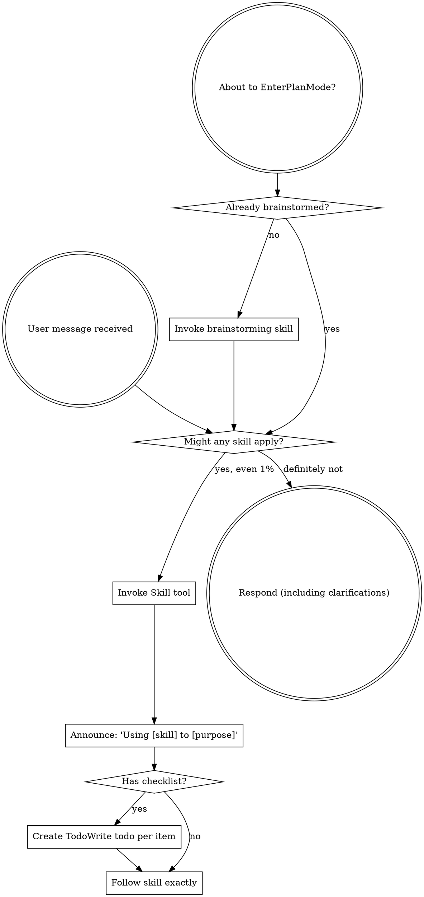

<SUBAGENT-STOP>
If you were dispatched as a subagent to execute a specific task, skip this skill.
</SUBAGENT-STOP>

<EXTREMELY-IMPORTANT>
If you think there is even a 1% chance a skill might apply to what you are doing, you ABSOLUTELY MUST invoke the skill.

IF A SKILL APPLIES TO YOUR TASK, YOU DO NOT HAVE A CHOICE. YOU MUST USE IT.

This is not negotiable. This is not optional. You cannot rationalize your way out of this.
</EXTREMELY-IMPORTANT>

## Lane Decision (superpowers-lite)

Before invoking any other skill on a new implementation task, **ask the user which lane to use** via the AskUserQuestion tool. Do NOT classify the lane yourself. Announce the lane the user picks explicitly: **"Lane: fast"**, **"Lane: middle"**, or **"Lane: full"**.

**Skip the ask only when:**
- The user's message already declares the lane explicitly ("fast lane", "middle lane", "full lane", "just do it" = fast, "let's plan this properly" = full)
- A lane is already set for the current task from a prior turn in the same conversation

In all other cases, ask. The cost of one extra question is seconds; the cost of working in the wrong lane is hours.

This decision is the developer's, not yours. Do not infer a lane from file counts, ticket presence, or task wording.

### The three lanes

**Fast lane** — drop nearly all ceremony. Typical use:
- ≤~4 files, self-contained
- Copy edits, styling tweaks, single-function bug fix, config flips, missing log line, rename inside one module
- No API/schema/infra change, no design judgment needed
- See `brainstorming` Fast-Lane Mini-Brainstorm and `writing-plans` Fast-Lane TodoWrite Plan

**Middle lane** — short plan, no design ceremony, single review at the end. Typical use:
- Medium refactor inside one module/service (5–15 files), no API leaving the module
- Bug fix spanning 2–3 files (e.g., a race condition fixed across a small graph)
- New feature that slots into existing patterns — CLI subcommand, admin page, endpoint mirroring an existing one
- Internal API change touching 5–10 internal call sites
- Dependency upgrade requiring multi-site migration
- Performance fix (caching, indexing, query rewrite) across a few files
- Design-system / copy sweep across many files when a written plan helps
- Test coverage / test infrastructure refactor
- New component/page on existing infra
- **Pre-launch schema or public-API changes** — with no live consumers, design ceremony doesn't yet pay off. Once the project is live, these move to full lane.
- Tickets labeled feature/story when the change still slots into existing patterns (ticket presence alone does not push to full lane)

Middle lane writes a short committed plan doc, skips brainstorming/spec, and runs a single reviewer-subagent pass at the end. Subagent implementers are optional — use them if they speed up multi-file work, skip them for inline coding.

**Full lane** — design + plan + per-task review. Use for:
- New dependency or new piece of infrastructure
- Genuine architectural decisions with real trade-offs (design forks where two paths have different long-term implications)
- Cross-service or cross-team coordination
- Post-launch breaking changes to public APIs or schemas
- User explicitly asks for a design doc, RFC, or "let's plan this out"

Full lane is bit-for-bit the upstream superpowers methodology.

### Picking the lane

When a new implementation task arrives and no lane is set, before invoking any other skill, call AskUserQuestion with three options (fast / middle / full). Use one-line summaries drawn from the use-cases above. Wait for the answer, announce the lane, and proceed. Do not pick yourself if the user is available to pick.

### Reclassifying

The user can switch lanes at any time ("switch to middle", "this is bigger than I thought, let's do full"). Honor the switch immediately.

If during work you discover the task is bigger than the picked lane (hidden complexity, design fork emerges, new dependency surfaces), STOP and ask the user whether to reclassify via AskUserQuestion. Don't silently escalate ceremony, and don't silently push through with an under-ceremonious lane.

Downstream skills (`brainstorming`, `writing-plans`, `subagent-driven-development`, `test-driven-development`) read the lane and adjust their behavior.

## House voice (every lane)

Write code and comments the way the humans already in the repo do — match the surrounding file's comment density and tone. These machine-writing tells are banned in every lane:

- **Tour-guide comments** — narrating what the code does step by step ("first… then…", "in one transaction: A, B, C"). The body below already says that; delete it. Keep only what the code *can't* say: a non-obvious invariant, a fail-closed reason, a lock ordering. A doc comment longer than the body it sits on is wrong.
- **Speculative abstraction** — an interface, `*.strategy`, factory, or DI seam with one real implementation, added "to swap later." Write the concrete thing; add the seam when the second implementation arrives.
- **Clever over clear** — if you can't say what a function does in one plain sentence, simplify the code instead of explaining it in a paragraph.

A repo's AGENTS.md / CLAUDE.md style rules override this with specifics; when unsure, read three neighbouring files and imitate them.

## Instruction Priority

Superpowers skills override default system prompt behavior, but **user instructions always take precedence**:

1. **User's explicit instructions** (CLAUDE.md, GEMINI.md, AGENTS.md, direct requests) — highest priority
2. **Superpowers skills** — override default system behavior where they conflict
3. **Default system prompt** — lowest priority

If CLAUDE.md, GEMINI.md, or AGENTS.md says "don't use TDD" and a skill says "always use TDD," follow the user's instructions. The user is in control.

## How to Access Skills

**In Claude Code:** Use the `Skill` tool. When you invoke a skill, its content is loaded and presented to you—follow it directly. Never use the Read tool on skill files.

**In Copilot CLI:** Use the `skill` tool. Skills are auto-discovered from installed plugins. The `skill` tool works the same as Claude Code's `Skill` tool.

**In Gemini CLI:** Skills activate via the `activate_skill` tool. Gemini loads skill metadata at session start and activates the full content on demand.

**In other environments:** Check your platform's documentation for how skills are loaded.

## Platform Adaptation

Skills use Claude Code tool names. Non-CC platforms: see `references/copilot-tools.md` (Copilot CLI), `references/codex-tools.md` (Codex) for tool equivalents. Gemini CLI users get the tool mapping loaded automatically via GEMINI.md.

# Using Skills

## The Rule

**Invoke relevant or requested skills BEFORE any response or action.** Even a 1% chance a skill might apply means that you should invoke the skill to check. If an invoked skill turns out to be wrong for the situation, you don't need to use it.

## Red Flags

These thoughts mean STOP—you're rationalizing:

| Thought | Reality |
|---------|---------|
| "This is just a simple question" | Questions are tasks. Check for skills. |
| "I need more context first" | Skill check comes BEFORE clarifying questions. |
| "Let me explore the codebase first" | Skills tell you HOW to explore. Check first. |
| "I can check git/files quickly" | Files lack conversation context. Check for skills. |
| "Let me gather information first" | Skills tell you HOW to gather information. |
| "This doesn't need a formal skill" | If a skill exists, use it. |
| "I remember this skill" | Skills evolve. Read current version. |
| "This doesn't count as a task" | Action = task. Check for skills. |
| "The skill is overkill" | Simple things become complex. Use it. |
| "I'll just do this one thing first" | Check BEFORE doing anything. |
| "This feels productive" | Undisciplined action wastes time. Skills prevent this. |
| "I know what that means" | Knowing the concept ≠ using the skill. Invoke it. |

## Skill Priority

When multiple skills could apply, use this order:

1. **Process skills first** (brainstorming, debugging) - these determine HOW to approach the task
2. **Implementation skills second** (frontend-design, mcp-builder) - these guide execution

"Let's build X" → brainstorming first, then implementation skills.
"Fix this bug" → debugging first, then domain-specific skills.

## Skill Types

**Rigid** (TDD, debugging): Follow exactly. Don't adapt away discipline.

**Flexible** (patterns): Adapt principles to context.

The skill itself tells you which.

## User Instructions

Instructions say WHAT, not HOW. "Add X" or "Fix Y" doesn't mean skip workflows.
